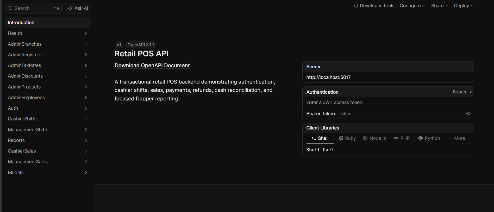
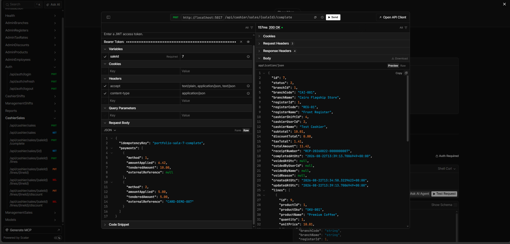
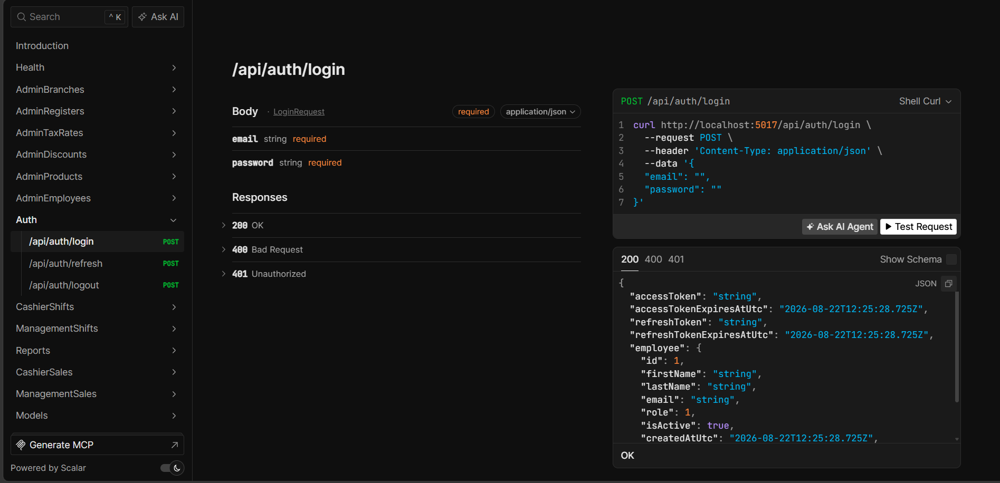
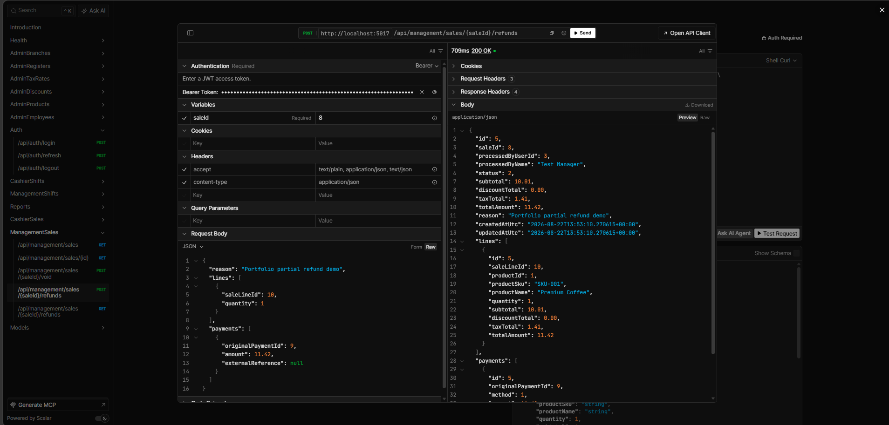
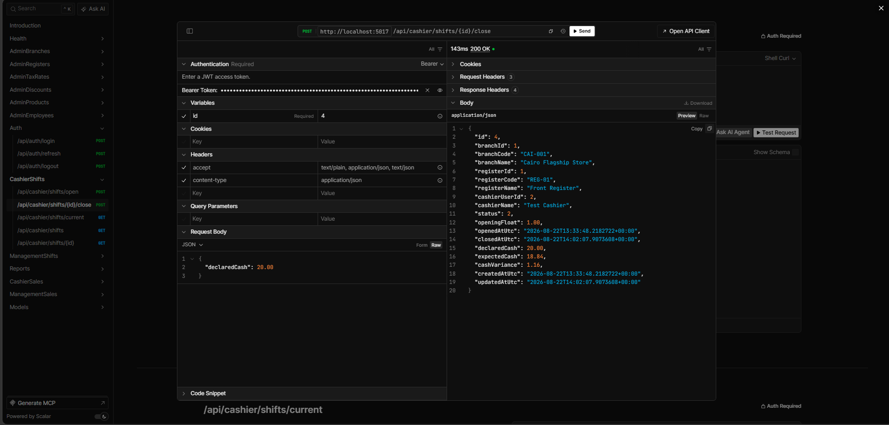
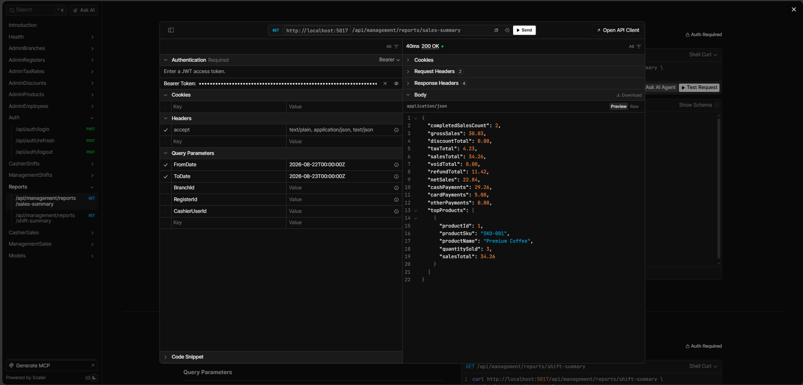
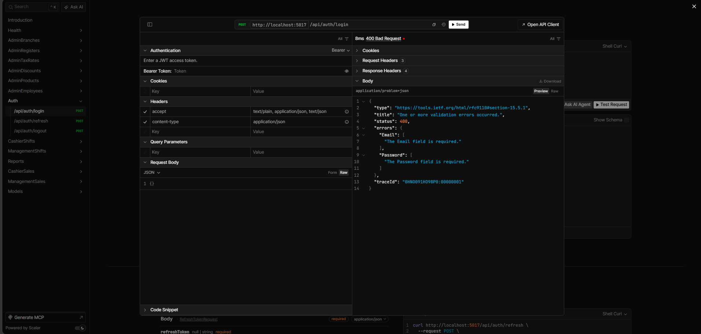

# Retail POS API

[](https://github.com/Ibrahim-Abdallah/RetailPOSApi/actions/workflows/ci.yml)

RetailPOSApi is a production-oriented ASP.NET Core backend for transactional retail workflows beyond CRUD. It presents a focused, reviewable implementation of employee access, cashier operations, financial lifecycle rules, reconciliation, and reporting.

## Engineering highlights

- JWT authentication, role authorization, refresh-token rotation, replay protection, and hash-only refresh-token storage
- SQL Server and EF Core persistence with database transactions and concurrency protection
- One-open-shift guarantees for cashier and register; server-owned sale context and totals
- Deterministic `decimal` calculations using `MidpointRounding.AwayFromZero` and immutable financial snapshots
- Split-tender payments, cash change, idempotent completion, unique receipt numbers, voids, and partial/full refunds
- Server-calculated shift cash reconciliation and parameterized Dapper reports
- Relational SQLite integration tests, centralized safe Problem Details, built-in OpenAPI, and Development-only Scalar

## Technology

.NET 10, ASP.NET Core 10, C#, EF Core 10, SQL Server, Dapper, JWT Bearer, FluentValidation, built-in OpenAPI, Scalar, xUnit, and relational SQLite integration tests.

## Business workflow


## Architecture

The repository intentionally uses one Web API application and one test project. Controllers own HTTP concerns, focused services enforce workflows, EF Core owns transactional persistence, and Dapper serves two read-only reports. This keeps business rules visible without ceremonial layers. See [Architecture](docs/architecture.md).

## Core business rules

- A cashier and register can each have only one open shift.
- Cashier, branch, register, status, receipt number, and totals are server-authoritative.
- Sale lines snapshot product, price, discount, and tax data; later catalog changes do not rewrite history.
- Money is rounded to two decimals, AwayFromZero, at defined calculation boundaries.
- Completion is transactional, requires exact applied-payment matching, supports cash tender/change and split payments, and is idempotent.
- Refund quantities cannot exceed historical sold quantities; refund values come from snapshots. Refunded sales cannot be voided and voided sales cannot be refunded.
- Shift closing includes opening float, completed cash sales, cash refunds, and void cash effects; variance is declared minus expected cash.
- Reports use event activity timestamps and parameterized SQL rather than current entity state alone.

## Roles

| Role | Main permissions |
| --- | --- |
| Admin | Employee and POS configuration, management views, lifecycle operations, reports |
| Manager | Management sales/shifts, eligible voids/refunds, reports |
| Cashier | Own shift, open-sale building/completion, own sales, shift closing |

There is no public registration or client-selected role.

## API areas

- Auth: `POST /api/auth/login`, `/refresh`, `/logout`
- Employees: `/api/admin/employees`
- Configuration: `/api/admin/branches`, `/registers`, `/products`, `/tax-rates`, `/discounts`
- Cashier shifts: `/api/cashier/shifts`; management shifts: `/api/management/shifts`
- Cashier sales and completion: `/api/cashier/sales`, `/api/cashier/sales/{id}/complete`
- Management sales, voids, refunds: `/api/management/sales`
- Reporting: `/api/management/reports/sales-summary`, `/shift-summary`

See [API workflows](docs/api-workflows.md) for representative request sequences.

## Reporting semantics

Sales enter the requested `[fromDate, toDate)` window at completion; voids at the void timestamp; refunds at their creation timestamp. `NetSales = SalesTotal - VoidTotal - RefundTotal`. Payment-method figures are gross completed payment amounts and are intentionally not netted against voids or refunds.

## Local setup

```powershell
dotnet tool restore
dotnet restore
dotnet user-secrets --project ./src/RetailPOSApi/RetailPOSApi.csproj set "Jwt:SigningKey" "<at-least-32-character-development-secret>"
dotnet ef database update --project ./src/RetailPOSApi --startup-project ./src/RetailPOSApi
dotnet run --project ./src/RetailPOSApi
```

The LocalDB connection committed for development has no credentials. Optional first-admin provisioning uses `BootstrapAdmin:Enabled`, `FirstName`, `LastName`, `Email`, and `Password` from User Secrets or environment variables. It is disabled by default and should be disabled after provisioning. Never commit these values.

Development endpoints: `GET /health`, `/openapi/v1.json`, and `/scalar/v1`. OpenAPI and Scalar are mapped only in Development.

## Authentication

Send credentials to `POST /api/auth/login`, retain returned tokens securely, and use `Authorization: Bearer <access-token>` for protected calls. Exchange the refresh token through `POST /api/auth/refresh`; rotation invalidates the previous token. Examples deliberately omit real credentials and tokens.

## Testing and quality

```powershell
dotnet build
dotnet test
dotnet list src/RetailPOSApi package --vulnerable --include-transitive
dotnet list tests/RetailPOSApi.Tests package --vulnerable --include-transitive
```

xUnit tests run through a relational SQLite `WebApplicationFactory`, not EF InMemory, and cover authorization, transactions, snapshots, idempotency, concurrency coordination, lifecycle accounting, reports, OpenAPI, and safe Problem Details. Provider-specific locking and filtered-index behavior should also be verified manually against SQL Server. See [Testing and quality](docs/testing-and-quality.md).

Current verified regression suite: **324 tests, 0 failures**.

## Documentation

- [Documentation index](docs/README.md)
- [Architecture](docs/architecture.md)
- [API workflows](docs/api-workflows.md)
- [Testing and quality](docs/testing-and-quality.md)
- [Screenshot index](screenshots/README.md)

## Screenshots

| API discovery and authentication | Transactional sale completion |
| --- | --- |
| <br>Scalar presents the API surface in navigable business-area groups. | <br>A completed sale preserves receipt context, authoritative totals, line snapshots, and payment results. |
| <br>Scalar exposes the JWT Bearer security scheme for authenticated API exploration. | <br>A partial refund uses historical sale values and exposes the resulting lifecycle state. |
| **Cash reconciliation** | **Dapper reporting** |
| <br>Shift closing records opening, declared, expected, and variance amounts calculated by the API. | <br>The focused report returns activity-window totals, payment-method figures, and top products. |
| **Standards-based API errors** |  |
| <br>Validation failures use structured `application/problem+json` with field-level errors and a trace identifier. |  |

## V1 scope exclusions

V1 intentionally excludes a frontend or mobile UI, warehouse/inventory management, suppliers and purchase orders, real payment gateways or terminals, accounting/payroll, offline sync, multi-currency, loyalty/CRM, microservices, message brokers, caching infrastructure, and deployment orchestration.

This repository demonstrates a compact ASP.NET Core design for security-sensitive, transactional, financially deterministic business workflows while remaining approachable to a client or reviewer.
