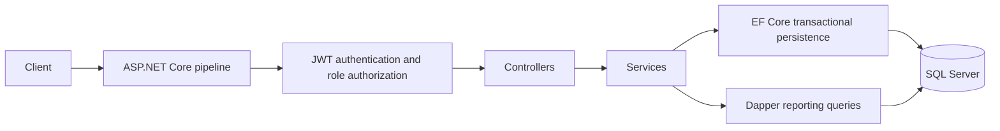
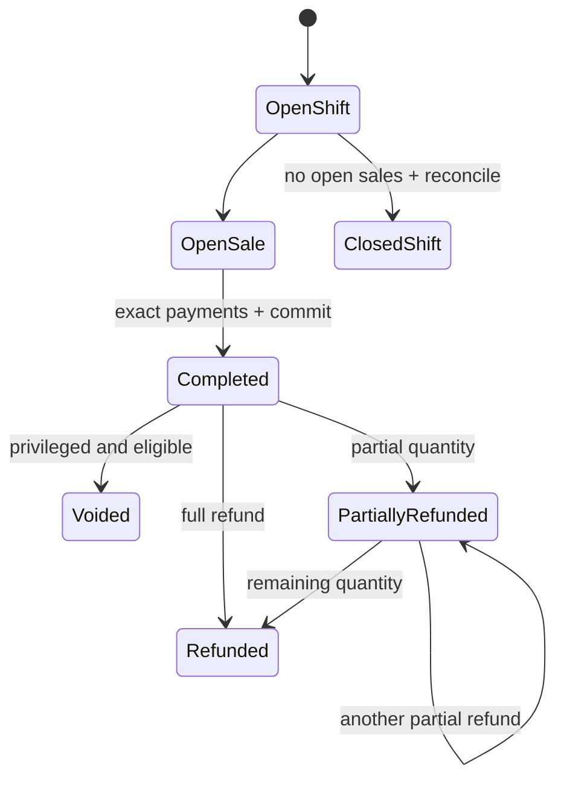
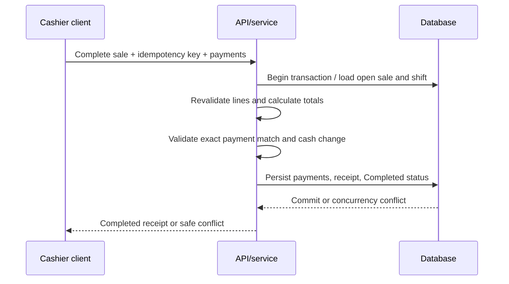
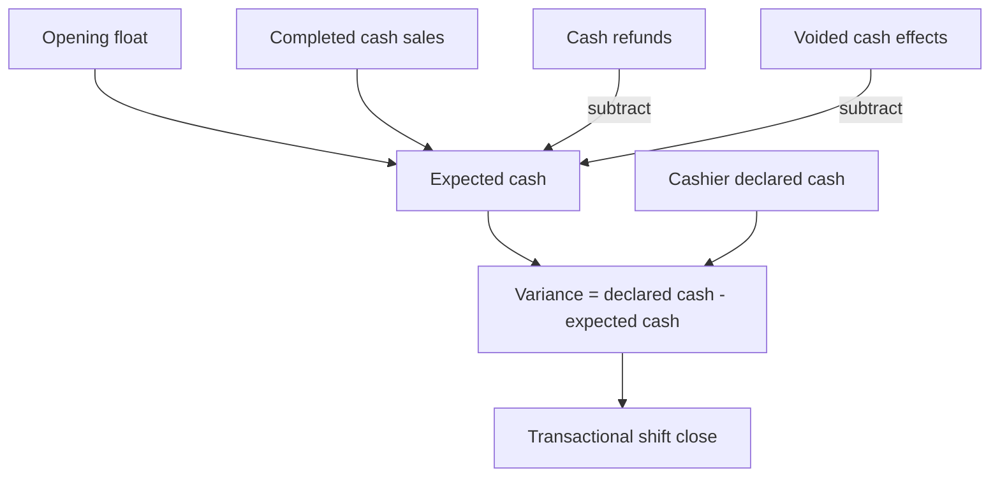

# Architecture

## Intent and structure

RetailPOSApi is deliberately a single ASP.NET Core Web API plus one test project. It favors focused domain services and explicit business workflows over generic repositories, CQRS, or extra class libraries.

Controllers translate HTTP input, FluentValidation results, and service outcomes into standard responses. Services own authentication and POS rules. `AppDbContext` and entity configurations own mappings, constraints, indexes, and transactions. EF Core is the system of record; Dapper is limited to parameterized sales and shift summary reads.

## Lifecycle and transaction boundaries

Sale completion, void/refund operations, and shift closing define explicit transaction boundaries. Database constraints and concurrency tokens back service pre-checks. Coordinators in integration tests force overlapping save windows so conflict paths are exercised deterministically.

## Time, money, and history

Time-dependent services use injected `TimeProvider`; persisted activity timestamps are UTC `DateTimeOffset` values. Monetary calculations use `decimal`, explicit two-place rounding, and `MidpointRounding.AwayFromZero`. Sale lines store names, prices, discounts, tax rates, per-unit calculations, and totals as historical snapshots. Refunds calculate from those snapshots, never the live catalog.

## Shift reconciliation

An open sale blocks closing. Expected cash and variance are server-calculated and stored as historical values.

## Authorization and API safety

JWT validation checks issuer, audience, signing key, lifetime, and roles with zero clock skew. Admin, Manager, and Cashier surfaces use role attributes; login, refresh, logout, and health are anonymous by design. Refresh tokens are cryptographically generated and stored only as hashes. OpenAPI and Scalar exist only in Development. Central exception handling logs method, path, trace ID, and the exception server-side while returning a generic Problem Details response with no exception detail.
